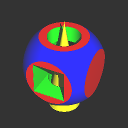

# cginc
**cginc** provides very simple way to construct CSG model and visualize it in C.

- cginc uses ray casting to render a 3D world.
- cginc operates union(+), intersection(*) and difference(-) on sets.
- cginc writes the result of its process into BMP file.
- cginc displays the output image in a viewer (MS Paint by default) automatically.
- cginc allows texture mapping.

## Model Definition

A model is defined by like ```Model#, type-name, <color-info>, <shape-info>```

| Type | Shape-Info | Note |
| :---- | :-------- |:------|
| rect  | <x, x', y, y', z, z'>  |(x,y,z) = Corner1, (x',y',z') = Corner2 like Box of Povray|
| cyli  | <Base point, Cap z, Radius>  ||
| sphe  | <Center, Radius>  ||
| cone  | <Center of Base circle, Radius of Base circle, Cap z>  ||

## Example
Setup for CSG, writen in csgfile.txt
```
1,rect,<1,0,0,1,0,0>,<-4,4,-4,4,-4,4>
2,sphe,<0,0,1,1,0,0>,<0,0,0,5>
3,rect,<0,1,0,1,0,0>,<-6,6,-2,2,-2,2>
4,cyli,<0,1,0,1,0,0>,<0,0,-6,6,2>
5,cone,<1,1,0,1,0,0>,<0,0,-6,6,2>
(+ (- (* 1 2 )  (+ 3 4) ) 5)
```
The last line is the operation, that defines how models are combined and constructs one object.

Setup for the environment, including lights, viewpoint and some properties of output image, written in envsetting.csv.
```
sample.bmp
1
40,30,40
1,1,1
40,20,35
0,0,0
0,0,1
256,256
0.06
```
From the top, output file name, the number of lights, the position of the light, the color of the light, the viewpoint,
the center of the screen, up-vector, the size of the output image and scale.

**Output image (sample.bmp)**



